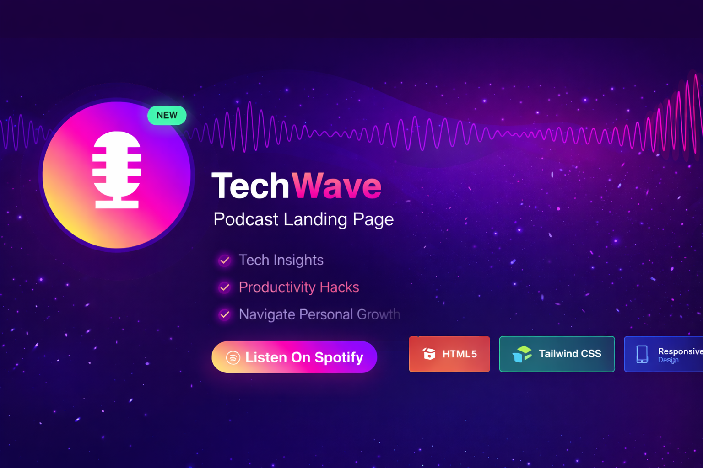

  

<h1 align="center">🎙 TechWave — Podcast Landing Page</h1>

---

## 📌 Project Overview

**TechWave** is a fully responsive podcast landing page designed to showcase tech-focused episodes, featured content, and subscription engagement.

The project emphasizes modern UI composition, gradient aesthetics, waveform-inspired visuals, and strong call-to-action structuring to create an immersive media experience.

---

## 🔗 Live Demo

👉 https://rzoshin.github.io/TechWave/

---

## ✨ Key Features

- 🎧 Hero section with animated waveform-inspired design  
- 📱 Fully responsive layout (mobile-first approach)  
- 🎙 Featured episodes section with embedded media  
- ⭐ Why Choose Us feature grid  
- 📝 About podcast section  
- 🔔 Subscription call-to-action  
- 🌙 Modern gradient-based UI system  

---

## 🛠 Technologies Used

- **HTML5**
- **Tailwind CSS**
- Responsive Web Design
- Utility-first CSS architecture
- Flexbox & Grid layout systems

---

## 🎨 Design Highlights

- Gradient typography effects
- Neon-style glow buttons
- Modern dark theme interface
- Clean section hierarchy
- Structured spacing & layout consistency

---

## 🎯 Purpose of the Project

This project was developed to:

- Strengthen Tailwind CSS layout mastery
- Practice responsive landing page design
- Implement modern UI/UX principles
- Build a professional media-style interface
- Improve component-based structuring

---

## 🚀 Future Enhancements

- Podcast episode filtering system
- Dynamic content loading
- Backend subscription integration
- Blog integration
- Dark/Light theme toggle

---

## 👨‍💻 Author

**Raiyan Zannat**  
CSE Graduate | MSc Engineering Candidate |
Focused on Front-End Systems, AI, and Modern Web Interfaces